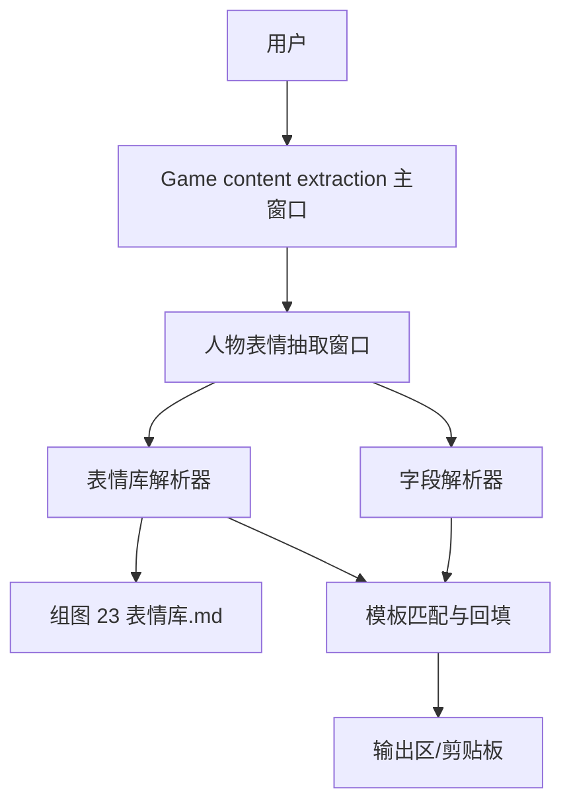
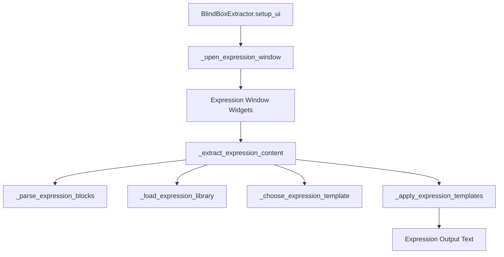
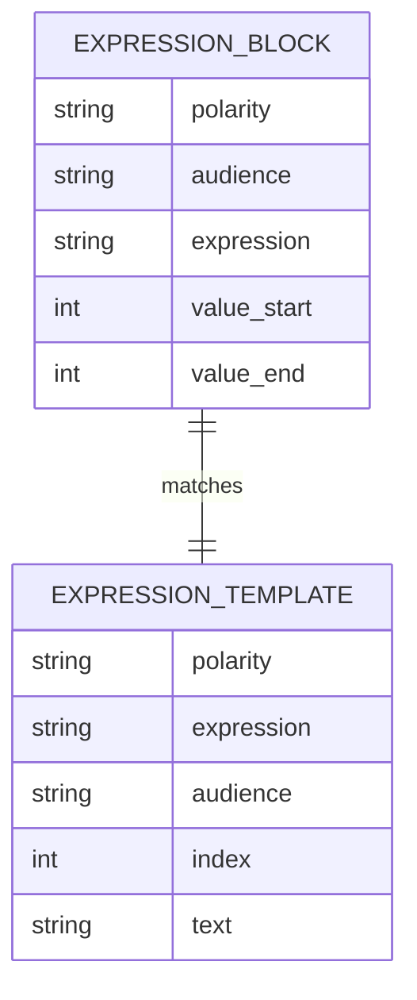

# Architecture: 人物表情抽取窗口

架构采用保守扩展：在现有 `内容抽取.py` 的 tkinter 主类中新增人物表情抽取窗口入口和独立处理管线。处理管线由字段解析、表情库解析、模板选择、原文局部回填和错误提示组成，不改变现有盲盒/动物抽取流程。

## System Overview

### Architecture Style

本地单进程 tkinter 桌面工具。新增能力作为主类中的独立窗口和纯函数式辅助方法实现。

### System Context Diagram



## Component Architecture

### Component Diagram



### Component Descriptions

| Component | Responsibility | Technology | Dependencies |
|-----------|----------------|------------|--------------|
| Window Entry | 在主窗口增加按钮并打开 Toplevel | tkinter/ttk | `setup_ui` |
| Expression Window Widgets | 输入、策略选择、抽取、清空、复制、输出 | tkinter/scrolledtext | 主 root |
| Field Parser | 解析表情组文本和字段 span | Python `re` | 输入文本 |
| Library Parser | 读取 Markdown 表情库并构建索引 | Python file IO, `re` | `组图 23 表情库.md` |
| Template Selector | 根据单人/多人和编号策略选模板 | Python | ExpressionTemplate |
| Replacement Engine | 原文局部回填具体表情字段 | Python string slicing | ExpressionBlock |

## Technology Stack

### Core Technologies

| Layer | Technology | Version | Rationale |
|-------|------------|---------|-----------|
| GUI | tkinter/ttk | Python stdlib | 与现有工具一致 |
| Parsing | Python `re` | Python stdlib | 无新增依赖 |
| Storage | Markdown local file | UTF-8 | 表情库已有维护源 |
| Packaging | PyInstaller spec | Existing | 项目已有 spec |

### Key Libraries & Frameworks

| Library | Purpose | License |
|---------|---------|---------|
| tkinter | 本地桌面 UI | Python stdlib |
| re | 字段和 Markdown 解析 | Python stdlib |
| os | 路径处理 | Python stdlib |

## Architecture Decision Records

| ADR | Title | Status | Key Choice |
|-----|-------|--------|------------|
| [ADR-001](ADR-001-toplevel-window.md) | 使用独立 Toplevel 窗口 | Accepted | 隔离表情功能与现有主流程 |
| [ADR-002](ADR-002-markdown-library.md) | 读取 Markdown 表情库 | Accepted | 保持表情库为单一事实源 |
| [ADR-003](ADR-003-parse-and-replace.md) | 解析和原文局部回填 | Accepted | 保持原输入结构 |

## Data Architecture

### Data Model



### Data Storage Strategy

| Data Type | Storage | Retention | Backup |
|-----------|---------|-----------|--------|
| 表情库 | `组图 23 表情库.md` | 长期维护 | Git |
| 表情输入/输出 | UI Text widget | 临时 | 不保存 |
| 抽取历史 | 不使用 | N/A | N/A |

## API Design

该功能无外部 API。内部函数建议签名：

| Function | Purpose |
|----------|---------|
| `_open_expression_window()` | 创建或聚焦人物表情抽取窗口 |
| `_parse_expression_blocks(text)` | 返回 ExpressionBlock 列表 |
| `_load_expression_library()` | 返回 ExpressionTemplate 索引 |
| `_choose_expression_template(library, block, strategy, index)` | 返回模板 |
| `_apply_expression_templates(text, replacements)` | 返回增强文本 |

## Security Architecture

### Security Controls

| Control | Implementation | Requirement |
|---------|----------------|-------------|
| Local only | 不访问网络，不执行用户输入 | [NFR-P-001](../requirements/NFR-P-001-local-fast.md) |
| File boundary | 只读取固定表情库路径 | [REQ-003](../requirements/REQ-003-library-lookup.md) |
| Error containment | 用户错误只写入输出区 | [REQ-006](../requirements/REQ-006-error-handling.md) |

## Infrastructure & Deployment

### Deployment Architecture

仍为本地 Python/tkinter 应用。若打包为 exe，`内容抽取.spec` 需要确认表情库 Markdown 是否被加入 datas。

### Environment Strategy

| Environment | Purpose | Configuration |
|-------------|---------|---------------|
| Development | 本地运行 Python 文件 | 从仓库相对路径读取 Markdown |
| Packaged exe | 用户运行工具 | 通过 PyInstaller datas 或旁置文件读取 Markdown |

## Codebase Integration

### Existing Code Mapping

| New Component | Existing Module | Integration Type | Notes |
|---------------|-----------------|------------------|-------|
| Window Entry | `Game content extraction/内容抽取.py` | Extend | 在按钮区新增入口 |
| Parser/Matcher | `Game content extraction/内容抽取.py` | Extend | 先保持同文件，避免过度重构 |
| Packaging Data | `Game content extraction/内容抽取.spec` | Modify if needed | 加入 Markdown datas |

### Migration Notes

无数据迁移。不得修改 `draw_history.json` schema。

## Quality Attributes

| Attribute | Target | Measurement | ADR Reference |
|-----------|--------|-------------|---------------|
| Performance | 双组输入 <= 500ms | 手工计时 | [ADR-002](ADR-002-markdown-library.md) |
| Reliability | 主抽取流程无回归 | 示例输入回归 | [ADR-001](ADR-001-toplevel-window.md) |
| Maintainability | 表情库单一事实源 | 无重复数据文件 | [ADR-002](ADR-002-markdown-library.md) |
| Usability | 3 步完成增强复制 | UX smoke test | [ADR-001](ADR-001-toplevel-window.md) |

## State Machine

### Expression Extraction Lifecycle

```text
Idle -> InputReady -> Parsed -> Matched -> Rendered
  |        |            |        |         |
  |        | parse err  | match err         copy
  |        v            v        v         |
  +---- ErrorDisplayed <----------+--------+
```

| From State | Event | To State | Side Effects | Error Handling |
|------------|-------|----------|--------------|----------------|
| Idle | user pastes text | InputReady | Text widget updated | N/A |
| InputReady | extract clicked | Parsed | ExpressionBlock list built | Missing fields -> ErrorDisplayed |
| Parsed | library loaded | Matched | Templates selected | Missing/invalid template -> ErrorDisplayed |
| Matched | apply replacements | Rendered | Output widget updated | Replacement conflict -> ErrorDisplayed |
| Rendered | copy clicked | Rendered | Clipboard updated | Empty output ignored |

## Configuration Model

### Optional Configuration

| Field | Type | Default | Constraint | Description |
|-------|------|---------|------------|-------------|
| template_strategy | enum | specified | specified/random | 模板选择策略 |
| template_index_single | int | 4 | 1-4 | 单人模板编号 |
| template_index_multi | int | 5 | 5-8 | 多人模板编号 |
| expression_library_path | path | repo root md | exists | 表情库路径 |

## Error Handling

### Error Classification

| Category | Severity | Retry | Example |
|----------|----------|-------|---------|
| UserInput | Low | Yes | 缺少具体表情字段 |
| Library | Medium | Yes after file fix | 表情库文件缺失 |
| RuleMismatch | Low | Yes | 负向输入选择正向表情 |
| Internal | Medium | No | 替换 span 冲突 |

### Per-Component Error Strategy

| Component | Error Scenario | Behavior | Recovery |
|-----------|----------------|----------|----------|
| Field Parser | 缺字段 | 输出中文提示 | 用户补字段 |
| Library Parser | 文件不存在 | 输出路径提示 | 检查文件或打包配置 |
| Template Selector | 编号越界 | 输出合法范围 | 用户改编号 |
| Replacement Engine | 已有模板 | 覆盖或提示，不叠加 | 用户确认后重试 |

## Observability

本地工具不需要遥测。开发验证使用人工 smoke test 和单元级函数测试。

## Implementation Guidance

### Key Decisions for Implementers

| Decision | Options | Recommendation | Rationale |
|----------|---------|----------------|-----------|
| UI 形态 | 主界面内嵌 / Toplevel / Notebook | Toplevel | 隔离功能且符合“新增窗口” |
| 数据源 | Markdown / Python 常量 | Markdown | 单一事实源 |
| 回填方式 | 重写全文 / 局部替换 | 局部替换 | 保持 prompt 格式 |
| 占位符 | 自动替换 / 保留 | 保留 | 避免脑补 |

### Implementation Order

1. 表情库解析和验收样例。
2. 字段解析和局部回填。
3. Toplevel UI 和复制按钮。
4. 错误路径和打包配置。

### Testing Strategy

| Layer | Scope | Tools | Coverage Target |
|-------|-------|-------|-----------------|
| Unit | parser, library lookup, replacement | Python assertions or unittest | 核心函数 80%+ |
| Integration | window callback flow | manual smoke | 主路径通过 |
| Regression | existing blind-box extraction | manual smoke | 无回归 |

## Risks & Mitigations

| Risk | Impact | Probability | Mitigation |
|------|--------|-------------|------------|
| Markdown 结构变化导致解析失败 | Medium | Medium | 启动时结构校验和清晰错误 |
| 打包后找不到表情库 | High | Medium | 更新 PyInstaller datas 或旁置路径 |
| 重复点击叠加模板 | Medium | Medium | 检测已有眉/眼/嘴并覆盖或提示 |
| 自动替换占位符引发脑补 | High | Low in MVP | MVP 明确保留占位符 |

## Open Questions

- [ ] 打包策略选择 datas 还是外部旁置文件？
- [ ] 重复回填默认覆盖还是提示？

## References

- Derived from: [Requirements](../requirements/_index.md), [Product Brief](../product-brief.md)
- Next: [Epics & Stories](../epics/_index.md)
