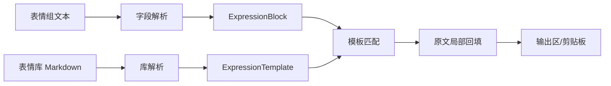

# Requirements: 人物表情抽取窗口

本 PRD 定义人物表情抽取窗口的用户可见能力、解析和匹配规则、输出约束以及非功能要求。MVP 必须完成窗口入口、字段解析、表情库查找、模板编号选择、原文局部回填和错误提示。

## Requirement Summary

| Priority | Count | Coverage |
|----------|-------|----------|
| Must Have | 5 | 可用窗口、字段解析、查库、回填复制、错误提示 |
| Should Have | 1 | 模板策略扩展和随机选择 |
| Could Have | 0 | 第一版不加入额外增强 |
| Won't Have | 3 | Web 化、自动占位符替换、历史降权 |

## Functional Requirements

| ID | Title | Priority | Traces To |
|----|-------|----------|-----------|
| [REQ-001](REQ-001-expression-window.md) | 人物表情抽取窗口入口 | Must | [G-001](../product-brief.md#goals--success-metrics) |
| [REQ-002](REQ-002-field-parser.md) | 表情组字段解析 | Must | [G-002](../product-brief.md#goals--success-metrics) |
| [REQ-003](REQ-003-library-lookup.md) | 表情库查找与校验 | Must | [G-002](../product-brief.md#goals--success-metrics) |
| [REQ-004](REQ-004-template-selection.md) | 模板编号选择 | Should | [G-002](../product-brief.md#goals--success-metrics) |
| [REQ-005](REQ-005-output-copy.md) | 原文局部回填与复制 | Must | [G-004](../product-brief.md#goals--success-metrics) |
| [REQ-006](REQ-006-error-handling.md) | 中文错误提示 | Must | [G-002](../product-brief.md#goals--success-metrics) |

## Non-Functional Requirements

### Performance

| ID | Title | Target |
|----|-------|--------|
| [NFR-P-001](NFR-P-001-local-fast.md) | 本地快速处理 | 双组输入 500ms 内完成 |

### Usability

| ID | Title | Target |
|----|-------|--------|
| [NFR-U-001](NFR-U-001-simple-copy-flow.md) | 简洁复制流程 | 3 步内完成增强和复制 |

### Reliability

| ID | Title | Target |
|----|-------|--------|
| [NFR-R-001](NFR-R-001-no-regression.md) | 不回归现有抽取 | 现有主流程不变 |

## Data Requirements

### Data Entities

| Entity | Description | Key Attributes |
|--------|-------------|----------------|
| ExpressionBlock | 输入中的一组表情字段 | polarity, audience, expression, span |
| ExpressionTemplate | 表情库中的一条眉/眼/嘴模板 | polarity, expression, audience, index, text |
| ReplacementResult | 回填后的输出结果 | original_text, enhanced_text, diagnostics |

### Data Flows

## Integration Requirements

| System | Direction | Protocol | Data Format | Notes |
|--------|-----------|----------|-------------|-------|
| `内容抽取.py` 主窗口 | Inbound | tkinter callback | Python method call | 新增按钮打开窗口 |
| `组图 23 表情库.md` | Inbound | local file read | Markdown text | 运行时解析或打包为 datas |
| Clipboard | Outbound | tkinter clipboard | plain text | 复制输出区内容 |

## Constraints & Assumptions

### Constraints

- `开始抽取` 的盲盒/动物逻辑 MUST 不变。
- 表情模板 MUST 来自表情库，不得编造。
- 第一版 SHOULD 保留占位符。

### Assumptions

- 表情库编号结构稳定。
- 用户可接受在窗口中选择模板编号。
- 双组输入可通过 `极性:` 字段切分。

## Priority Rationale

窗口、解析、查库、回填和错误提示共同构成最小可用闭环，因此为 Must。模板编号选择是用户示例稳定验收的关键，但具体 UI 可先简单实现，因此为 Should。

## Traceability Matrix

| Goal | Requirements |
|------|--------------|
| G-001 | [REQ-001](REQ-001-expression-window.md), [NFR-U-001](NFR-U-001-simple-copy-flow.md) |
| G-002 | [REQ-002](REQ-002-field-parser.md), [REQ-003](REQ-003-library-lookup.md), [REQ-004](REQ-004-template-selection.md), [REQ-006](REQ-006-error-handling.md), [NFR-P-001](NFR-P-001-local-fast.md) |
| G-003 | [NFR-R-001](NFR-R-001-no-regression.md) |
| G-004 | [REQ-005](REQ-005-output-copy.md) |

## Open Questions

- [ ] 默认模板策略是否应为随机还是指定编号？
- [ ] 打包时是否把 Markdown 文件加入 PyInstaller datas？

## References

- Derived from: [Product Brief](../product-brief.md)
- Next: [Architecture](../architecture/_index.md)
