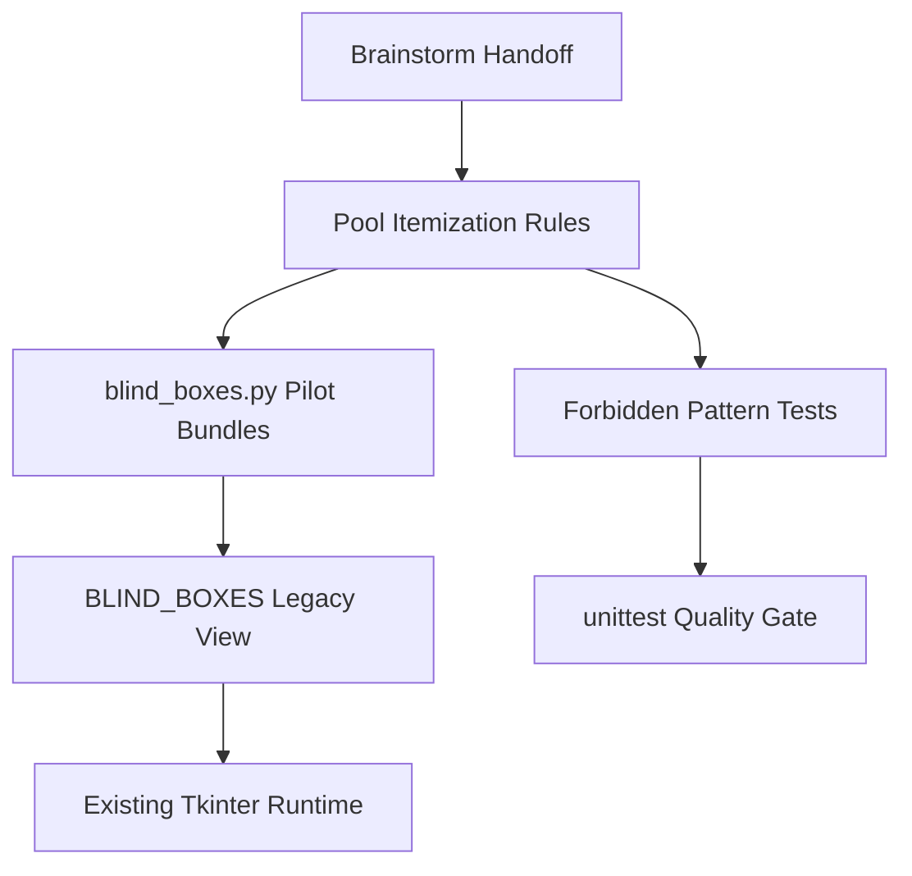
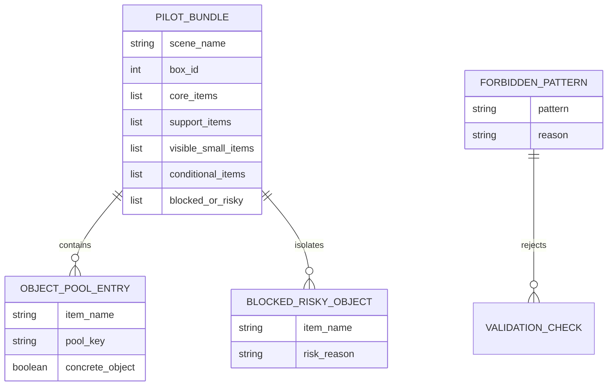

# Architecture: 盲盒条件池与风险池物品化修正

本架构采用静态数据补丁方式，不改运行时输入、UI 或历史结构。修正核心是把五层池统一约束为具体物品池，并将非物品禁用表达从内容数据中剥离为测试/审查规则。

## System Overview

## Component Architecture

| Component | Responsibility | Technology | Dependencies |
|-----------|----------------|------------|--------------|
| `Pool Itemization Rules` | 定义五层池都只能写具体物品。 | Markdown spec / docs | REQ-001, REQ-002 |
| `Pilot Bundle Patch` | 替换 15/16/17 三类试点条件池和风险池。 | Python dict/list | REQ-001, REQ-002, REQ-004 |
| `ForbiddenPatternValidation` | 禁止非物品表达进入任一五层池。 | `unittest` | REQ-003, NFR-R-001 |
| `LegacyRuntimeView` | 保持 `BLIND_BOXES` 四栏 contract。 | Existing Python data | REQ-004 |
| `DocumentationSync` | 同步维护说明和用户说明。 | Markdown | REQ-005 |

## Technology Stack

| Layer | Technology | Rationale |
|-------|------------|-----------|
| Data | Python dict/list | 与 `blind_boxes.py` 现有形态一致。 |
| Validation | Python `unittest` | 复用现有测试风格，无新依赖。 |
| Runtime | Existing `tkinter` app | 不触碰 UI 和输入逻辑。 |
| Docs | UTF-8 Markdown | 符合仓库提示词/工具文档维护方式。 |

## Architecture Decision Records

| ADR | Title | Status | Key Choice |
|-----|-------|--------|------------|
| [ADR-001](ADR-001-pool-entry-object-only.md) | 五层池条目必须是具体物品 | Accepted | 统一所有池层的最低内容底线。 |
| [ADR-002](ADR-002-blocked-risky-as-object-pool.md) | `blocked_or_risky` 保留为具体风险物池 | Accepted | 不把非物品现象放进风险池。 |
| [ADR-003](ADR-003-forbidden-pattern-validation.md) | 非物品禁用模式进入测试校验 | Accepted | 用测试防止折线、擦痕、阴影等回流。 |
| [ADR-004](ADR-004-compatibility-preservation.md) | 保持四栏运行时兼容 | Accepted | 不改 UI、输入、历史和盒号。 |

## Data Architecture

## Codebase Integration

| New/Changed Area | Existing File | Integration Type | Notes |
|------------------|---------------|------------------|-------|
| Pilot pool replacement | `Game content extraction/data/blind_boxes.py` | Edit static data | Only update three pilot bundles. |
| Forbidden pattern test | `Game content extraction/test_blind_box_content_model.py` | Extend tests | Add assertions across all five pool keys. |
| Docs | `agents.md`, `README.md`, `Game content extraction/CLAUDE.md`, `Game content extraction/README.md` | Sync | Clarify object-only rule. |

## Testing Strategy

| Layer | Scope | Tool | Target |
|-------|-------|------|--------|
| Unit | Five-layer pool schema and forbidden patterns | `unittest` | Pass |
| Compatibility | Boxes 15/16/17 expose four runtime buckets | `unittest` | Pass |
| Static review | Docs contain corrected rules | Manual / search | No conflicting wording |

## Risks & Mitigations

| Risk | Impact | Mitigation |
|------|--------|------------|
| Forbidden pattern keywords overmatch legitimate objects | Medium | Keep forbidden list focused on explicit non-object terms. |
| Content edit drifts into full rewrite | Medium | Limit to 15/16/17 pool replacement. |
| Docs still imply risk pool can store phenomena | Medium | Sync docs with explicit object-only language. |

## References

- Derived from: [Requirements](../requirements/_index.md)
- Next: [Epics & Stories](../epics/_index.md)
