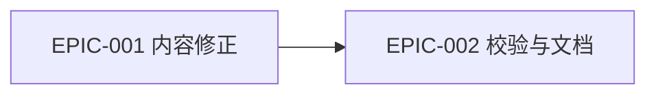

# Epics & Stories: 盲盒条件池与风险池物品化修正

## Epic Overview

| Epic ID | Title | Priority | MVP | Stories | Est. Size |
|---------|-------|----------|-----|---------|-----------|
| [EPIC-001](EPIC-001-pilot-pool-content-correction.md) | 三类试点池层内容修正 | Must | Yes | 3 | M |
| [EPIC-002](EPIC-002-validation-and-documentation.md) | 禁用模式校验与文档同步 | Must | Yes | 3 | S |

## Dependency Map

### Recommended Execution Order

1. [EPIC-001](EPIC-001-pilot-pool-content-correction.md): 先替换数据，建立正确目标状态。
2. [EPIC-002](EPIC-002-validation-and-documentation.md): 再用测试锁定目标状态，并同步文档。

## MVP Scope

### MVP Epics

两个 Epic 全部属于 MVP。范围限定在 15 / 16 / 17 三个试点盒，不扩展到全量 20 类。

### MVP Definition of Done

- [ ] 三类试点 `conditional_items` 均为中等以上体量的具体物品。
- [ ] 三类试点 `blocked_or_risky` 均为具体风险物。
- [ ] forbidden patterns 测试覆盖所有五层池。
- [ ] 四栏 runtime contract 保持。
- [ ] 项目文档同步完成。

## Traceability Matrix

| Requirement | Epic | Stories | Architecture |
|-------------|------|---------|--------------|
| [REQ-001](../requirements/REQ-001-conditional-items-visible-object.md) | [EPIC-001](EPIC-001-pilot-pool-content-correction.md) | STORY-001-001 | [ADR-001](../architecture/ADR-001-pool-entry-object-only.md) |
| [REQ-002](../requirements/REQ-002-blocked-risky-concrete-object.md) | [EPIC-001](EPIC-001-pilot-pool-content-correction.md) | STORY-001-002 | [ADR-002](../architecture/ADR-002-blocked-risky-as-object-pool.md) |
| [REQ-004](../requirements/REQ-004-pilot-runtime-compatibility.md) | [EPIC-001](EPIC-001-pilot-pool-content-correction.md) | STORY-001-003 | [ADR-004](../architecture/ADR-004-compatibility-preservation.md) |
| [REQ-003](../requirements/REQ-003-forbidden-pattern-validation.md) | [EPIC-002](EPIC-002-validation-and-documentation.md) | STORY-002-001, STORY-002-002 | [ADR-003](../architecture/ADR-003-forbidden-pattern-validation.md) |
| [REQ-005](../requirements/REQ-005-documentation-sync.md) | [EPIC-002](EPIC-002-validation-and-documentation.md) | STORY-002-003 | [ADR-001](../architecture/ADR-001-pool-entry-object-only.md) |
| [NFR-R-001](../requirements/NFR-R-001-regression-prevention.md) | [EPIC-002](EPIC-002-validation-and-documentation.md) | STORY-002-001 | [ADR-003](../architecture/ADR-003-forbidden-pattern-validation.md) |
| [NFR-U-001](../requirements/NFR-U-001-maintainer-clarity.md) | [EPIC-002](EPIC-002-validation-and-documentation.md) | STORY-002-003 | [ADR-001](../architecture/ADR-001-pool-entry-object-only.md) |

## Risks & Considerations

| Risk | Affected Epics | Mitigation |
|------|----------------|------------|
| 禁词测试误伤合法物品 | EPIC-002 | 使用精准 forbidden patterns，不写过宽词。 |
| 替换内容仍过小 | EPIC-001 | 以 handoff 推荐样例为基线，并执行人工 review。 |

## References

- Derived from: [Requirements](../requirements/_index.md), [Architecture](../architecture/_index.md)
