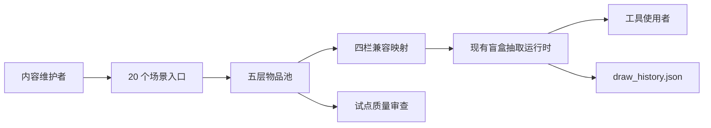
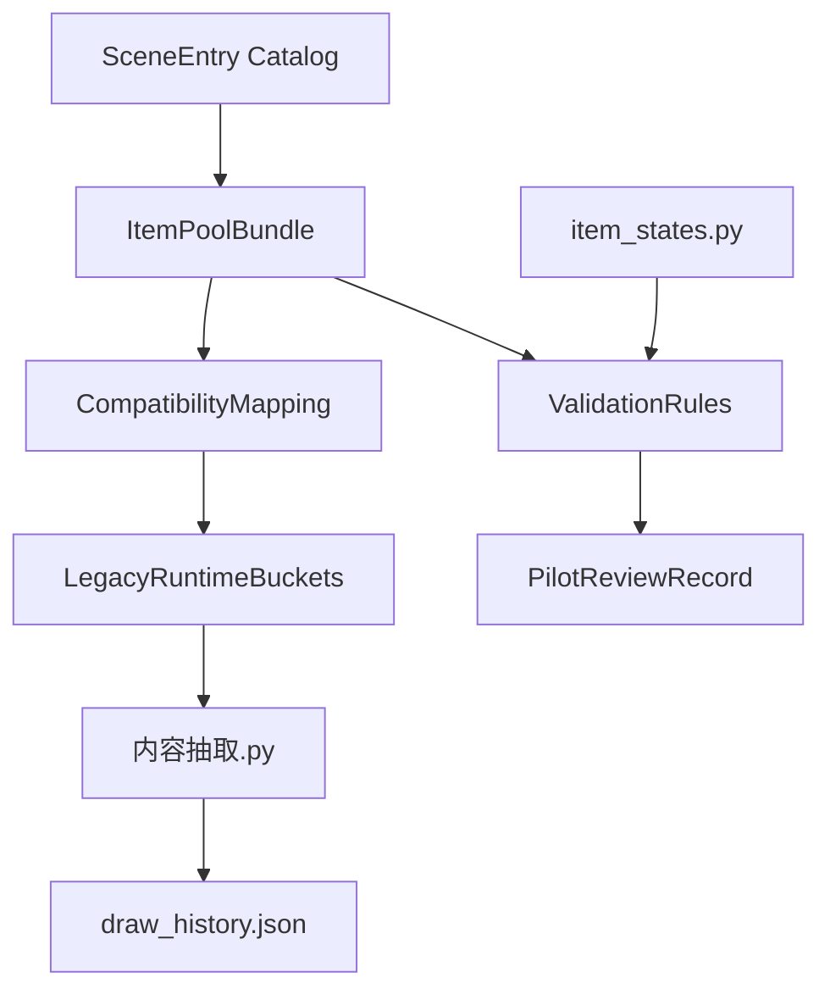
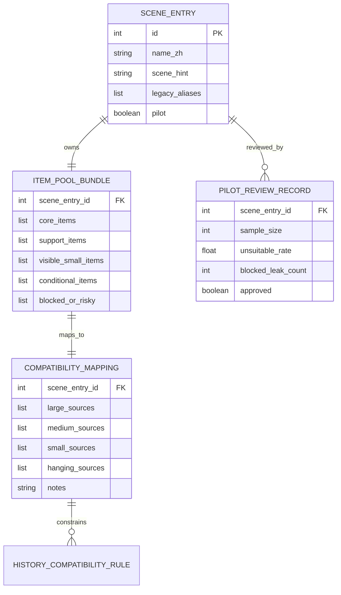

# Architecture: Game content extraction 盲盒物品内容库重构

本架构把盲盒物品库定义为“静态内容模型 + 兼容映射 + 质量验证”的本地数据架构。短期不改变 `tkinter` 工具、输入语法、历史文件或运行时四栏 key；新模型先作为内容作者和后续实现的规范层，映射回现有 `large`、`medium`、`small`、`hanging` 后再被工具消费。

## System Overview

### Architecture Style

采用本地静态数据架构。核心资产仍位于 `Game content extraction/data/`，不引入 Web、数据库、服务端或远程依赖。新内容模型可以先以 Python dict/list 或相邻规范文件表达，运行时继续消费四栏结构。

### System Context Diagram

## Component Architecture

| Component | Responsibility | Technology | Dependencies |
|-----------|----------------|------------|--------------|
| `SceneEntry Catalog` | 定义 20 个“场景+用途”入口、短名、旧入口别名和试点标记。 | UTF-8 Python data / Markdown spec | [REQ-001](../requirements/REQ-001-scene-entry-taxonomy.md), [NFR-U-001](../requirements/NFR-U-001-chinese-scanability-and-operability.md) |
| `ItemPoolBundle` | 保存每类五层池：`core_items`、`support_items`、`visible_small_items`、`conditional_items`、`blocked_or_risky`。 | Python dict/list | [REQ-002](../requirements/REQ-002-five-layer-item-pool-schema.md) |
| `CompatibilityMapping` | 把五层池映射为旧运行时四栏 key。 | Pure data transform | [REQ-003](../requirements/REQ-003-four-bucket-compatibility-mapping.md), [NFR-P-001](../requirements/NFR-P-001-compatibility-latency-budget.md) |
| `ValidationRules` | 校验 schema、风险词、默认池泄漏、试点抽样质量。 | Python unit tests / review checklist | [REQ-005](../requirements/REQ-005-quality-risk-validation.md) |
| `PilotReviewRecord` | 记录三个试点类别抽样、不适合率、风险泄漏与审批状态。 | Markdown / JSON artifact | [REQ-004](../requirements/REQ-004-pilot-category-deliverables.md) |
| `LegacyRuntimeBuckets` | 维持 `large`、`medium`、`small`、`hanging` 输出形态。 | Existing Python runtime | [REQ-006](../requirements/REQ-006-history-and-input-compatibility.md) |

## Technology Stack

| Layer | Technology | Version | Rationale |
|-------|------------|---------|-----------|
| Desktop UI | `tkinter` | Python stdlib | 保持现有本地工具，不扩大工程形态。 |
| Data model | Python dict/list + UTF-8 Markdown spec | Existing repo style | 与 `blind_boxes.py` 当前形态一致，便于逐类迁移。 |
| Persistence | `draw_history.json` | Existing local JSON | 不新增历史结构，避免破坏降权语义。 |
| Validation | `unittest` + py_compile +人工 spot check | Existing workflow | 覆盖静态数据、映射和试点质量。 |

## Architecture Decision Records

| ADR | Title | Status | Key Choice |
|-----|-------|--------|------------|
| [ADR-001](ADR-001-scene-entry-content-model.md) | 20 个场景入口作为内容模型主索引 | Accepted | 用“场景+用途”替代旧宽泛主题认知。 |
| [ADR-002](ADR-002-five-layer-to-four-bucket-mapping.md) | 五层池映射回四栏运行时 | Accepted | 新模型先在内容层生效，运行时保持旧 key。 |
| [ADR-003](ADR-003-pilot-first-rollout.md) | 三个试点优先而非全量替换 | Accepted | 先验证桌面、特殊主题、户外场景。 |
| [ADR-004](ADR-004-risk-isolation-validation.md) | 风险物隔离与验证门禁 | Accepted | `blocked_or_risky` 不进入默认输出。 |
| [ADR-005](ADR-005-history-input-compatibility.md) | 保持旧输入与历史语义 | Accepted | 逗号输入、box id、四栏历史 key 先不迁移。 |

## Data Architecture

### Data Model

### Mapping Rules

| Runtime Bucket | Source Layer | Inclusion Rule | Exclusion Rule |
|----------------|--------------|----------------|----------------|
| `large` | `core_items` | 场景锚点、边界清楚、可单独圈选。 | 不用容器类或背景性大物凑数。 |
| `medium` | `support_items` + 少量 `core_items` | 主力补充物，独立可见且不抢主体。 | 不引入依赖承载面才成立的条目。 |
| `small` | `visible_small_items` | 小物必须块状、成组或有明确承载面。 | 禁止微型痕迹、细线、边缘接缝。 |
| `hanging` | 少量 `conditional_items` | 明确悬挂或挂放关系，并可在图中合理承载。 | 不作为补量池，不默认承接风险物。 |
| 默认不可抽 | `blocked_or_risky` | 仅供审查、提示作者避让和未来人工判断。 | 不映射到任何默认四栏。 |

## Codebase Integration

| New Component | Existing Module | Integration Type | Notes |
|---------------|-----------------|------------------|-------|
| `SceneEntry Catalog` | `Game content extraction/data/blind_boxes.py` | Extend / Replace data | 首期可通过注释或相邻结构表达新入口，最终逐类替换旧主题。 |
| `CompatibilityMapping` | `Game content extraction/内容抽取.py` | Preserve consumer contract | 运行时仍看到 `large`、`medium`、`small`、`hanging`。 |
| `ValidationRules` | `Game content extraction/test_*.py` | New tests | 增加 schema 与风险泄漏测试，不依赖 UI。 |
| `PilotReviewRecord` | `.workflow/.spec/` or project docs | New artifact | 用于判定是否扩展到更多类别。 |
| `DocumentationSyncChecklist` | `agents.md`, `README.md`, `Game content extraction/CLAUDE.md`, `.gitignore` | Existing process | 每次执行任务后同步。 |

## Quality Attributes

| Attribute | Target | Measurement | ADR Reference |
|-----------|--------|-------------|---------------|
| Suitability | 试点抽样明显不适合项 < 10% | 每试点 30 次人工抽样 | [ADR-003](ADR-003-pilot-first-rollout.md), [ADR-004](ADR-004-risk-isolation-validation.md) |
| Compatibility | 旧输入和四栏输出样例 100% 可解析 | 现有单元测试 + 新兼容样例 | [ADR-002](ADR-002-five-layer-to-four-bucket-mapping.md), [ADR-005](ADR-005-history-input-compatibility.md) |
| Maintainability | 任一类别可独立重写、审查、回退 | 每类独立 bundle 和 mapping | [ADR-001](ADR-001-scene-entry-content-model.md) |
| Performance | 不增加可感知运行时负担 | 不新增多轮桶级扫描 | [ADR-002](ADR-002-five-layer-to-four-bucket-mapping.md) |

## Error Handling

| Category | Severity | Example | Behavior |
|----------|----------|---------|----------|
| Schema error | High | 缺少五层池任一字段 | 阻止试点通过，要求修正。 |
| Mapping error | High | `blocked_or_risky` 被映射进默认四栏 | 阻止合入或回退该类别。 |
| Compatibility error | High | 旧编号输入失效 | 回退映射或保留旧入口别名。 |
| Quality warning | Medium | 某层容器类条目过多 | 进入人工复审，不直接扩全量。 |
| Documentation drift | Medium | spec 与 README/CLAUDE 描述不一致 | 执行同步检查。 |

## Validation Strategy

| Layer | Scope | Tools | Coverage Target |
|-------|-------|-------|-----------------|
| Static schema | 20 类入口、五层字段、四栏映射字段 | `unittest` / data inspection | 100% pilot, expandable to all categories |
| Risk leakage | `blocked_or_risky` 不进入默认四栏 | Unit test | 0 leak |
| Compatibility | 旧逗号输入、四栏勾选、历史 key | Existing tests + new samples | No regression |
| Content quality | 试点抽样可见性、承载关系、不适合率 | Manual review record | < 10% unsuitable |
| Docs | 项目说明与维护约束 | Checklist | Required files updated |

## Implementation Guidance

1. 先实现或整理三类试点的数据结构：`桌面+学习`、`海底+潜水`、`公园+野餐`。
2. 为试点生成四栏兼容视图，保持运行时消费不变。
3. 增加 schema、风险泄漏和兼容输入测试。
4. 人工抽样 30 次并记录不适合率。
5. 通过后再扩展更多类别，避免一次性替换全部旧数据。

## Open Questions

- [ ] 旧 14 类编号在 UI 中是否保留为别名，还是在未来版本展示新 20 类？
- [ ] `item_states.py` 是否拆出盲盒专用安全状态表？
- [ ] 全量迁移时是否需要迁移 `draw_history.json` 历史 key？

## References

- Derived from: [Requirements](../requirements/_index.md), [Product Brief](../product-brief.md)
- Next: [Epics & Stories](../epics/_index.md)
