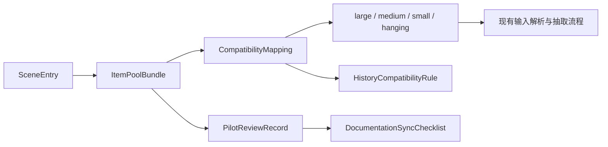

# Requirements: Game content extraction 盲盒物品内容库重构

本 PRD 约束盲盒物品库重构的内容模型、兼容边界与试点验收方式。Phase 3 只定义可测试需求，不承诺立即替换全部旧数据或升级运行时代码。

## Requirement Summary

| Priority | Count | Coverage |
|----------|-------|----------|
| Must Have | 5 | 20 个场景入口、五层池、四栏兼容、三类试点、质量门槛 |
| Should Have | 2 | 历史兼容细则、写库审查与文档同步 |
| Could Have | 0 | 本阶段不新增可延后需求 |
| Won't Have | 0 | 延后项以 product-brief 的 Out of Scope 为准 |

## Functional Requirements

| ID | Title | Priority | Traces To |
|----|-------|----------|-----------|
| [REQ-001](REQ-001-scene-entry-taxonomy.md) | 定义 20 个场景入口分类法 | Must | [G-001](../product-brief.md#goals--success-metrics) |
| [REQ-002](REQ-002-five-layer-item-pool-schema.md) | 定义五层物品池结构与入池规则 | Must | [G-002](../product-brief.md#goals--success-metrics) |
| [REQ-003](REQ-003-four-bucket-compatibility-mapping.md) | 定义五层池到四栏运行时的兼容映射 | Must | [G-003](../product-brief.md#goals--success-metrics) |
| [REQ-004](REQ-004-pilot-category-deliverables.md) | 交付三个试点类别的统一样板 | Must | [G-004](../product-brief.md#goals--success-metrics), [G-005](../product-brief.md#goals--success-metrics) |
| [REQ-005](REQ-005-quality-risk-validation.md) | 建立默认输出质量与风险隔离规则 | Must | [G-004](../product-brief.md#goals--success-metrics), [G-005](../product-brief.md#goals--success-metrics) |
| [REQ-006](REQ-006-history-and-input-compatibility.md) | 保持输入语法与历史语义兼容 | Should | [G-003](../product-brief.md#goals--success-metrics) |
| [REQ-007](REQ-007-authoring-review-and-doc-sync.md) | 规范写库审查、实施交接与文档同步 | Should | [G-005](../product-brief.md#goals--success-metrics) |

## Non-Functional Requirements

### Performance

| ID | Title | Target |
|----|-------|--------|
| [NFR-P-001](NFR-P-001-compatibility-latency-budget.md) | 兼容映射不得增加可感知运行时负担 | 维持现有单次抽取路径，不增加额外多轮桶级扫描 |

### Security

| ID | Title | Standard |
|----|-------|----------|
| [NFR-S-001](NFR-S-001-local-safety-boundary.md) | 重构不得突破本地静态数据安全边界 | 本地 `tkinter` 工具、无远程依赖、无新持久化面 |

### Scalability

| ID | Title | Target |
|----|-------|--------|
| [NFR-SC-001](NFR-SC-001-incremental-rollout-scale.md) | 模型支持 20 类增量扩展与逐类替换 | 任一类别可独立重写、审查、回退 |

### Usability

| ID | Title | Target |
|----|-------|--------|
| [NFR-U-001](NFR-U-001-chinese-scanability-and-operability.md) | 类别命名与操作入口保持高可扫读性 | 20 类中文短名统一遵循“场景+用途”，现有输入习惯不变 |

## Data Requirements

### Data Entities

| Entity | Description | Key Attributes |
|--------|-------------|----------------|
| `SceneEntry` | 一个用户可选择的盲盒类别入口。 | `id:int`, `name_zh:str`, `scene_hint:str`, `legacy_aliases:list[str]`, `pilot:bool` |
| `ItemPoolBundle` | 一个类别下的五层物品池集合。 | `scene_entry_id:int`, `core_items:list[str]`, `support_items:list[str]`, `visible_small_items:list[str]`, `conditional_items:list[str]`, `blocked_or_risky:list[str]` |
| `CompatibilityMapping` | 五层池回写到 `large`/`medium`/`small`/`hanging` 的规则。 | `scene_entry_id:int`, `large_sources:list[str]`, `medium_sources:list[str]`, `small_sources:list[str]`, `hanging_sources:list[str]`, `notes:str` |
| `PilotReviewRecord` | 试点类别的抽样与人工审查记录。 | `scene_entry_id:int`, `sample_size:int`, `unsuitable_rate:float`, `blocked_leak_count:int`, `review_notes:list[str]`, `approved:bool` |
| `HistoryCompatibilityRule` | 旧输入和 `draw_history` 语义的约束声明。 | `legacy_box_id:int`, `runtime_bucket:str`, `new_scene_entry_id:int`, `history_key_pattern:str`, `migration_required:bool` |
| `DocumentationSyncChecklist` | 实施时需要同步更新的文档清单。 | `paths:list[str]`, `trigger:str`, `owner_role:str`, `verified_at:str|null` |

### Data Flows

1. 维护者先定义 `SceneEntry` 与对应 `ItemPoolBundle`。
2. 每个 `ItemPoolBundle` 必须生成一份 `CompatibilityMapping`，才能继续接入现有四栏运行时。
3. 试点类别在映射后进入抽样，结果写入 `PilotReviewRecord`。
4. 若类别实施落地，必须同时检查 `HistoryCompatibilityRule` 与 `DocumentationSyncChecklist`。

## Integration Requirements

| System | Direction | Protocol | Data Format | Notes |
|--------|-----------|----------|-------------|-------|
| `Game content extraction/data/blind_boxes.py` | Outbound | Python import | Python dict/list | Phase 3 的模型最终需要映射回该静态数据文件 |
| `Game content extraction/内容抽取.py` | Both | In-process | Python objects / strings | 输入解析、输出格式与 bucket 绑定仍由该文件消费 |
| `Game content extraction/draw_history.json` | Both | Local file IO | JSON | 仅允许保持现有 `item_pools` 语义，不在本阶段扩展新历史结构 |
| `Game content extraction/data/item_states.py` | Inbound | Python import | Python list/dict | 状态词只能作为后续实现依赖，不能推翻本 PRD 的风险隔离规则 |
| `agents.md` 等文档 | Outbound | Markdown sync | UTF-8 Markdown | 实施阶段必须同步更新，但 Phase 3 只定义同步义务 |

## Constraints & Assumptions

### Constraints

- Phase 3 MUST 保持范围在内容规范、映射规则和验收方法，不扩展为代码实现计划。
- 新模型 MUST NOT 假设现有 `large`、`medium`、`small`、`hanging` 已被替换。
- 默认输出 MUST NOT 使用 `blocked_or_risky` 条目补数量。
- 本地桌面工具定位 MUST 保持不变，不引入 Web、数据库或服务端架构。

### Assumptions

- 20 类入口命名方向已被接受，可作为后续实现输入。
- 三个试点足以暴露高频、户外和特殊主题的主要风险。
- 历史 key 与旧编号兼容策略可先定义约束，迁移脚本可延后到实现阶段。

## Priority Rationale

Must 范围只保留“无法开始试点就无法验证模型”的内容：分类法、五层池、兼容映射、试点交付和质量门槛。历史兼容细则与文档同步虽然重要，但它们依赖前述核心模型稳定后才能执行，因此列为 Should。

## Traceability Matrix

| Goal | Requirements |
|------|-------------|
| G-001 | [REQ-001](REQ-001-scene-entry-taxonomy.md), [NFR-U-001](NFR-U-001-chinese-scanability-and-operability.md) |
| G-002 | [REQ-002](REQ-002-five-layer-item-pool-schema.md), [REQ-005](REQ-005-quality-risk-validation.md) |
| G-003 | [REQ-003](REQ-003-four-bucket-compatibility-mapping.md), [REQ-006](REQ-006-history-and-input-compatibility.md), [NFR-P-001](NFR-P-001-compatibility-latency-budget.md), [NFR-S-001](NFR-S-001-local-safety-boundary.md) |
| G-004 | [REQ-004](REQ-004-pilot-category-deliverables.md), [REQ-005](REQ-005-quality-risk-validation.md) |
| G-005 | [REQ-004](REQ-004-pilot-category-deliverables.md), [REQ-007](REQ-007-authoring-review-and-doc-sync.md), [NFR-SC-001](NFR-SC-001-incremental-rollout-scale.md) |

## Open Questions

- [ ] 旧编号是否需要在实施 phase 中映射到新 20 类别名，还是只维持内部映射表不暴露给用户？
- [ ] `item_states.py` 的状态词冲突是采用白名单还是拆分盲盒专用状态集？
- [ ] 全量扩库前，是否需要把每层最小条目数固化为 schema 校验规则？

## References

- Derived from: [Product Brief](../product-brief.md)
- Derived from: [Glossary](../glossary.json)
- Derived from: [Refined Requirements](../refined-requirements.json)
- Next: [Architecture](../architecture/_index.md)
