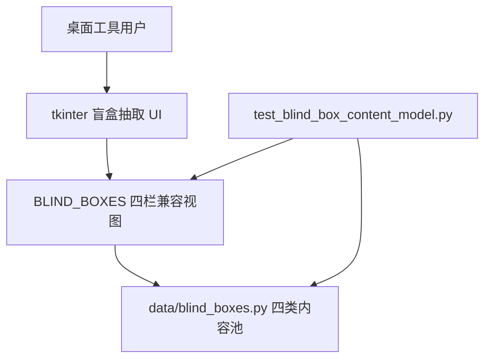
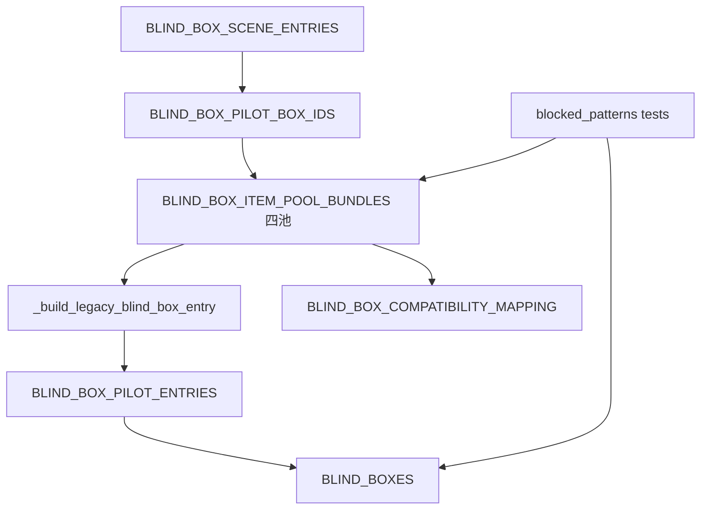
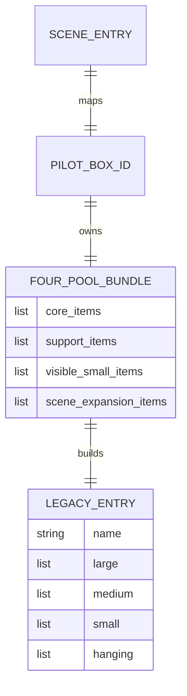

# Architecture: Game content extraction 盲盒物品四类内容池重构

本架构采用“静态数据模型重构 + 兼容视图生成 + 单元测试门禁”的方式落地四类内容池。底层三类试点只保留四个默认安全池，运行时继续导出 `BLIND_BOXES` 四栏视图，风险内容由测试层 `blocked_patterns` 约束。

## System Overview

### Architecture Style

本功能是本地 Python 数据模块的渐进式重构，不引入服务端、数据库、图像识别或新 UI。核心风格是静态数据源和派生兼容视图分离。

### System Context Diagram

## Component Architecture

### Component Diagram

### Component Descriptions

| Component | Responsibility | Technology | Dependencies |
|-----------|----------------|------------|--------------|
| `BLIND_BOX_ITEM_POOL_BUNDLES` | 三类试点四池内容源 | Python dict/list | `BLIND_BOX_PILOT_BOX_IDS` |
| `_build_legacy_blind_box_entry` | 将四池内容映射到旧四栏 | Python function | 四池 bundle |
| `BLIND_BOX_COMPATIBILITY_MAPPING` | 记录四池到四栏来源 | Python dict | 四池 bundle |
| `test_blind_box_content_model.py` | schema、禁用模式、兼容输出测试 | unittest | `data.blind_boxes` |
| 项目文档 | 维护规则和后续执行说明 | Markdown | spec 和实现结果 |

## Technology Stack

| Layer | Technology | Version | Rationale |
|-------|------------|---------|-----------|
| Language | Python | existing project | 与桌面工具一致 |
| UI | tkinter | existing project | 本轮不改 UI |
| Data | Python module constants | existing project | 最小改动，易审查 |
| Tests | unittest | stdlib | 项目已有测试方式 |
| Docs | Markdown / JSON | existing workflow | 与仓库规则一致 |

## Architecture Decision Records

| ADR | Title | Status | Key Choice |
|-----|-------|--------|------------|
| [ADR-001](ADR-001-four-pool-data-model.md) | 四类内容池作为试点数据源 | Accepted | 删除条件/风险候选池，保留四个默认安全池 |
| [ADR-002](ADR-002-scene-expansion-default-safe.md) | 场景扩展物作为第四类内容 | Accepted | 用无锚点默认安全物扩展场景变化 |
| [ADR-003](ADR-003-risk-as-validation.md) | 风险内容迁移为测试规则 | Accepted | `blocked_or_risky` 不再是内容池 |
| [ADR-004](ADR-004-legacy-mapping-preservation.md) | 保留四栏兼容视图 | Accepted | 运行时 `BLIND_BOXES` contract 不破坏 |

## Data Architecture

### Data Model

### Data Storage Strategy

| Data Type | Storage | Retention | Backup |
|-----------|---------|-----------|--------|
| 四池内容 | `data/blind_boxes.py` | tracked source | git |
| blocked patterns | test constant or future data constant | tracked source | git |
| workflow/spec docs | `.workflow/.spec/...` | tracked if accepted direction | git |

## Codebase Integration

### Existing Code Mapping

| New Component | Existing Module | Integration Type | Notes |
|---------------|-----------------|------------------|-------|
| 四池 bundle | `Game content extraction/data/blind_boxes.py` | Replace | 替换五层试点 bundle |
| 兼容构建函数 | `Game content extraction/data/blind_boxes.py` | Extend | 调整 `_build_legacy_blind_box_entry` 来源 |
| compatibility mapping | `Game content extraction/data/blind_boxes.py` | Update | 反映四池来源和风险规则移除 |
| 回归测试 | `Game content extraction/test_blind_box_content_model.py` | Update | 五层 schema 改四池 schema |
| UI | `Game content extraction/内容抽取.py` | Preserve | 不改默认导入 contract |

### Migration Notes

迁移顺序应先修改数据源和兼容映射，再更新测试断言，最后同步文档。若 `hanging` 无安全来源，宁可保守减少候选，也不要用细绳、挂饰或锚点依赖物补位。

## Quality Attributes

| Attribute | Target | Measurement | ADR Reference |
|-----------|--------|-------------|---------------|
| Compatibility | 旧四栏 contract 100% 保持 | unittest | [ADR-004](ADR-004-legacy-mapping-preservation.md) |
| Content Quality | 禁用模式 0 回流 | blocked pattern scan | [ADR-003](ADR-003-risk-as-validation.md) |
| Maintainability | 文档和测试同源描述四池 | doc/test review | [ADR-001](ADR-001-four-pool-data-model.md) |

## Implementation Guidance

### Key Decisions for Implementers

| Decision | Options | Recommendation | Rationale |
|----------|---------|----------------|-----------|
| 第四池命名 | `safe_hanging_items`, `optional_items`, `scene_expansion_items` | `scene_expansion_items` | 不绑定锚点或悬挂，表达扩展场景 |
| 风险内容位置 | 候选池 / excluded 池 / 测试规则 | 测试规则 | 避免误用为候选 |
| `hanging` 来源 | 强制填充 / 可为空或保守来源 | 保守来源 | 质量优先于数量 |

### Implementation Order

1. 更新 `blind_boxes.py` 四池 schema 和试点内容。
2. 调整 `_build_legacy_blind_box_entry` 与 `BLIND_BOX_COMPATIBILITY_MAPPING`。
3. 更新测试常量和断言。
4. 更新文档和 workflow 记录。

### Testing Strategy

| Layer | Scope | Tools | Coverage Target |
|-------|-------|-------|-----------------|
| Unit | 数据 schema、兼容映射、禁用模式 | unittest | 100% pilot coverage |
| Compile | Python syntax | py_compile | 目标文件通过 |
| Manual Review | 场景扩展物质量 | human review | 三类试点抽样 |

## Risks & Mitigations

| Risk | Impact | Probability | Mitigation |
|------|--------|-------------|------------|
| `scene_expansion_items` 变成杂物池 | Medium | Medium | 测试 + 文档定义中等以上、无锚点、场景相关 |
| `hanging` 为兼容被低质量填充 | High | Medium | 允许保守映射，不强制细线物补位 |
| 旧文档继续引用五层模型 | Medium | High | IMPL 中同步四个核心文档 |

## Open Questions

- [ ] `hanging` 最终是否可以为空？
- [ ] `scene_expansion_items` 是否进入 `large` 全量，还是部分进入？
- [ ] `blocked_patterns` 是否应从测试提升为数据常量？

## References

- Derived from: [Requirements](../requirements/_index.md), [Product Brief](../product-brief.md)
- Next: [Epics & Stories](../epics/_index.md)
