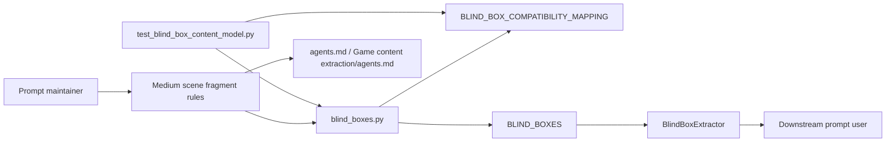
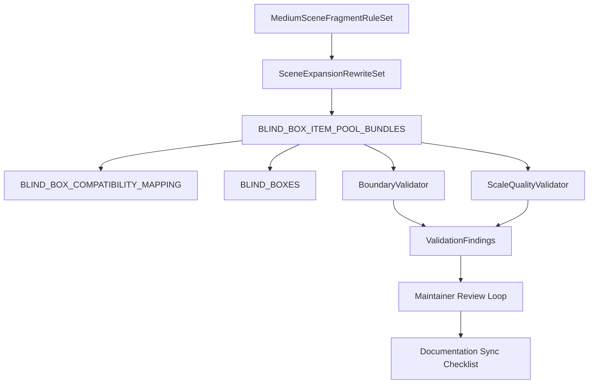
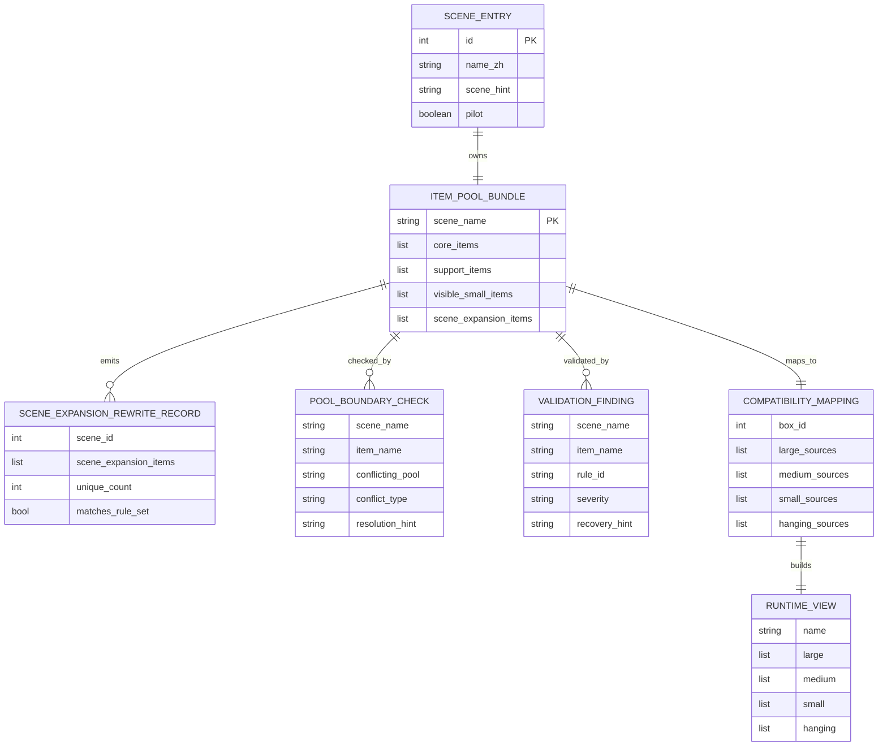

# Architecture: blind-box `scene_expansion_items` medium-scale scene fragments

本架构把本次工作限定为“静态数据重写 + 回归校验增强 + 稳定文档同步”的本地内容库演进。实现继续以 `Game content extraction/data/blind_boxes.py` 为事实源，以 `BLIND_BOXES` 和 `BLIND_BOX_COMPATIBILITY_MAPPING` 为公开兼容契约，不引入新运行时层、不修改 `tkinter` UI、也不改变 draw history 或动物/表情相关逻辑。

## System Overview

### Architecture Style

采用本地 data-library 架构。内容维护者编辑 UTF-8 Python 常量；回归逻辑通过 `unittest` 校验四池结构、语义边界和兼容映射；桌面工具继续消费既有运行时四栏视图。

### System Context Diagram



## Component Architecture

### Component Diagram



### Component Descriptions

| Component | Responsibility | Technology | Dependencies |
|-----------|----------------|------------|--------------|
| `MediumSceneFragmentRuleSet` | 定义 5 类允许家族、超大主体禁区、超小主体禁区、升级后的信息载体例外 | Markdown spec + Python constants | [REQ-001](../requirements/REQ-001-formal-medium-scene-fragment-model.md), [REQ-003](../requirements/REQ-003-scale-quality-validation.md) |
| `SceneExpansionRewriteSet` | 为 20 个场景各自产出 50 条唯一 `scene_expansion_items` | UTF-8 Python list | [REQ-002](../requirements/REQ-002-all-scene-rewrite-and-uniqueness.md), [NFR-U-001](../requirements/NFR-U-001-first-eye-visible-wording.md) |
| `BLIND_BOX_ITEM_POOL_BUNDLES` | 维护四池事实源，承接所有场景条目 | `blind_boxes.py` | [REQ-004](../requirements/REQ-004-pool-boundary-validation.md), [REQ-005](../requirements/REQ-005-runtime-and-unittest-compatibility.md) |
| `BLIND_BOX_COMPATIBILITY_MAPPING` | 声明四池到 `large` / `medium` / `small` / `hanging` 的公开来源关系 | Python dict | [REQ-005](../requirements/REQ-005-runtime-and-unittest-compatibility.md), [NFR-R-001](../requirements/NFR-R-001-regression-compatibility.md) |
| `BLIND_BOXES` | 向现有提取逻辑暴露运行时兼容视图 | Python dict | [REQ-005](../requirements/REQ-005-runtime-and-unittest-compatibility.md) |
| `BoundaryValidator` | 识别第四池与其余三池的职责冲突并给出迁移方向 | `unittest` assertions | [REQ-004](../requirements/REQ-004-pool-boundary-validation.md) |
| `ScaleQualityValidator` | 拦截柜/车/架/台等超大主体与卡/标签/票据等超小主体；放行合规中号例外 | `unittest` + rule tables | [REQ-003](../requirements/REQ-003-scale-quality-validation.md), [NFR-U-001](../requirements/NFR-U-001-first-eye-visible-wording.md) |
| `Maintainer Review Loop` | 固定规则复核、20 场景复核、稳定文档复核的顺序 | Maintainer workflow | [REQ-007](../requirements/REQ-007-maintainer-feedback-and-review.md), [NFR-M-001](../requirements/NFR-M-001-rule-maintainability.md) |

## Public Data Contract

### Public API Surface

本项目的“public API”是可被其他模块和维护流程依赖的公开数据契约，而不是 SDK 函数。

| Surface | Type | Consumer | Contract |
|---------|------|----------|----------|
| `BLIND_BOX_SCENE_ENTRIES` | `list[dict]` | 维护者、测试 | 保持 20 个 `场景+用途` 入口，`id` 和 `name_zh` 稳定 |
| `BLIND_BOX_ITEM_POOL_BUNDLES` | `dict[str, dict[str, list[str]]]` | 维护者、测试 | 每场景固定四池 key，且每池精确 50 条唯一 UTF-8 字符串 |
| `BLIND_BOX_COMPATIBILITY_MAPPING` | `dict[str, dict[str, object]]` | 测试、文档 | `large_sources=["core_items","scene_expansion_items"]`，`medium_sources=["support_items","core_items:first_6"]`，`small_sources=["visible_small_items"]`，`hanging_sources=[]` |
| `BLIND_BOXES` | `dict[int, dict[str, list[str] | str]]` | `BlindBoxExtractor` | 继续输出 `name`、`large`、`medium`、`small`、`hanging` 五键结构 |
| `test_blind_box_content_model.py` | regression baseline | 维护者 | 与新增质量规则一起构成统一回归基线 |

### Usage Examples

```python
from data.blind_boxes import BLIND_BOX_ITEM_POOL_BUNDLES

bundle = BLIND_BOX_ITEM_POOL_BUNDLES["公园+野餐"]
assert len(bundle["scene_expansion_items"]) == 50
```

```python
from data.blind_boxes import BLIND_BOX_COMPATIBILITY_MAPPING

mapping = BLIND_BOX_COMPATIBILITY_MAPPING["桌面+学习"]
assert mapping["large_sources"] == ["core_items", "scene_expansion_items"]
```

```python
from data.blind_boxes import BLIND_BOXES

runtime_box = BLIND_BOXES[12]
assert {"name", "large", "medium", "small", "hanging"} == set(runtime_box)
```

### Compatibility Matrix

| Consumer | Expected Input | Compatibility Promise |
|----------|----------------|-----------------------|
| `BlindBoxExtractor` | `BLIND_BOXES` legacy four-bucket view | 不改键名、不改 bucket 语义、不改 box id |
| `test_blind_box_content_model.py` | 四池事实源 + 兼容映射 | 继续覆盖 20 场景、50 唯一项、映射关系、风险词规则 |
| `agents.md` / `Game content extraction/agents.md` | 稳定语义规则 | 只同步模型边界和禁区，不复制长内容表 |
| prompt users | 盒号语义 | 20 个入口与编号保持稳定 |

### Dependency Policy

| Dependency Type | Policy | Rationale |
|-----------------|--------|-----------|
| Runtime dependencies | 仅使用 Python 标准库与现有 `tkinter` 工具 | 本次是数据库重写，不扩展应用形态 |
| Test dependencies | 仅使用现有 `unittest` | 保持回归基线简单、可本地执行 |
| Data source dependencies | `blind_boxes.py` 为唯一事实源 | 避免出现第二份场景片段词表 |
| Documentation dependencies | `agents.md`、`Game content extraction/agents.md`、`README.md`、`.gitignore` 只记录稳定规则和必要入口 | 控制文档漂移 |

## Technology Stack

| Layer | Technology | Version | Rationale |
|-------|------------|---------|-----------|
| Language | Python | project current | 现有桌面工具与数据事实源均使用 Python |
| UI consumer | `tkinter` | stdlib | 本次不改 UI，只保持消费者兼容 |
| Data format | Python dict/list + UTF-8 Markdown | existing repo style | 便于直接维护中文条目与规则 |
| Validation | `unittest` | stdlib | 已有回归套件，可直接扩展 |
| Versioning | Git + workflow spec artifacts | existing workflow | 支持规则审查和文档追踪 |

## Architecture Decision Records

| ADR | Title | Status | Key Choice |
|-----|-------|--------|------------|
| [ADR-001](ADR-001-medium-scene-fragment-model.md) | 固定 medium-scale scene fragment 内容模型 | Accepted | 用 5 类允许家族定义第四池，不再允许超大/超小主体充数 |
| [ADR-002](ADR-002-all-scene-rewrite-strategy.md) | 对 20 个场景执行全量重写而非 pilot-only 扩写 | Accepted | 一次完成全量 50x20 重写，避免双语义并存 |
| [ADR-003](ADR-003-scale-quality-validation.md) | 用质量闸门拦截超大与超小主体 | Accepted | 在现有 `unittest` 中增加可定位的语义校验 |
| [ADR-004](ADR-004-pool-boundary-rules.md) | 用职责边界区分四池 | Accepted | 第四池只承载中号场景片段，冲突项必须迁回其他池 |
| [ADR-005](ADR-005-runtime-compatibility.md) | 保持四池事实源与运行时四栏兼容契约 | Accepted | 不改 `BLIND_BOXES` 结构，不改 `BLIND_BOX_COMPATIBILITY_MAPPING` 公开关系 |
| [ADR-006](ADR-006-documentation-sync-policy.md) | 将文档同步限定为稳定规则边界 | Accepted | 只同步规则，不同步长列表，不把 spec 直接复制进入口文档 |
| [ADR-007](ADR-007-maintainer-review-loop.md) | 固定维护者审查闭环 | Accepted | 统一“规则复核 -> 场景复核 -> 文档复核”的审查顺序 |

## Data Architecture

### Data Model



### Data Storage Strategy

| Data Type | Storage | Retention | Backup |
|-----------|---------|-----------|--------|
| 四池内容 | `Game content extraction/data/blind_boxes.py` | tracked source | git |
| 质量规则 | `test_blind_box_content_model.py` 内规则表或同模块常量 | tracked source | git |
| 兼容视图 | `BLIND_BOXES` 派生常量 | runtime derived | git |
| 架构与规则说明 | `.workflow/.spec/...` 与稳定入口文档 | tracked workflow docs | git |

## Security & Integrity

### Integrity Controls

| Control | Implementation | Requirement |
|---------|---------------|-------------|
| Source-of-truth integrity | 只允许 `blind_boxes.py` 持有四池事实源 | [REQ-005](../requirements/REQ-005-runtime-and-unittest-compatibility.md) |
| Schema integrity | 校验四池 key、20 场景、每池 50 唯一项 | [REQ-002](../requirements/REQ-002-all-scene-rewrite-and-uniqueness.md), [NFR-R-001](../requirements/NFR-R-001-regression-compatibility.md) |
| Semantic integrity | 拦截超大/超小主体和跨池冲突 | [REQ-003](../requirements/REQ-003-scale-quality-validation.md), [REQ-004](../requirements/REQ-004-pool-boundary-validation.md) |
| Documentation integrity | 完成后检查四个稳定文档是否需要同步 | [REQ-006](../requirements/REQ-006-documentation-sync-checks.md), [NFR-M-001](../requirements/NFR-M-001-rule-maintainability.md) |

## Codebase Integration

### Existing Code Mapping

| New Component | Existing Module | Integration Type | Notes |
|--------------|-----------------|------------------|-------|
| `MediumSceneFragmentRuleSet` | `Game content extraction/data/blind_boxes.py` + workflow spec | Extend | 规则先在 spec 固化，再下沉为稳定维护规则 |
| `SceneExpansionRewriteSet` | `Game content extraction/data/blind_boxes.py` | Replace content | 只重写第四池内容，不改其余三池职责 |
| `BoundaryValidator` / `ScaleQualityValidator` | `Game content extraction/test_blind_box_content_model.py` | Extend tests | 新增规则校验，但与现有回归套件同一入口执行 |
| `DocumentationSyncChecklist` | `agents.md`, `Game content extraction/agents.md`, `README.md`, `.gitignore` | Existing process | 只在实现完成后同步稳定入口文档 |

## Quality Attributes

| Attribute | Target | Measurement | ADR Reference |
|-----------|--------|-------------|---------------|
| Compatibility | 现有 `BLIND_BOXES` 与映射断言 100% 通过 | `unittest` baseline | [ADR-005](ADR-005-runtime-compatibility.md) |
| Maintainability | 维护者 10 分钟内可扫描并复用规则 | 文档审查 | [ADR-006](ADR-006-documentation-sync-policy.md), [ADR-007](ADR-007-maintainer-review-loop.md) |
| Semantic precision | 第四池不再出现超大/超小主体主模式 | 规则闸门 + spot review | [ADR-001](ADR-001-medium-scene-fragment-model.md), [ADR-003](ADR-003-scale-quality-validation.md) |
| Boundary clarity | 四池冲突项可定位并给出迁移方向 | 校验输出 | [ADR-004](ADR-004-pool-boundary-rules.md) |

## State Machine

### SceneExpansionRewriteRecord Lifecycle

```text
[Draft Rule Set]
    | define allowed families / blocked roots
    v
[Draft Rewrite]
    | fill 50 unique scene_expansion_items
    v
[Validated]
    | pass count + uniqueness + scale + boundary checks
    | side effects: update bundle candidate
    |
    +---------------------------+
    | validation failure        |
    v                           |
[Rejected Finding]              |
    | remove large items / tiny items / conflicts
    | side effects: emit recovery_hint
    +---------------------------+
                retry
    |
    v
[Review Ready]
    | maintainer checks rules -> 20 scenes -> stable docs
    v
[Accepted]
    | side effects: merge data change, sync stable docs if needed
```

| From State | Event | To State | Side Effects | Error Handling |
|-----------|-------|----------|-------------|----------------|
| `Draft Rule Set` | rule families fixed | `Draft Rewrite` | 允许开始 20 场景重写 | 若规则仍含歧义，SHOULD 先修规则而非继续填词 |
| `Draft Rewrite` | count/uniqueness/boundary/scale pass | `Validated` | 生成可合并候选 | 任一失败 MUST 产出 `ValidationFinding` |
| `Draft Rewrite` | rule failure | `Rejected Finding` | 标注 `scene_name`、`item_name`、`rule_id` | MUST 给出 `recovery_hint` |
| `Validated` | maintainer review pass | `Review Ready` | 进入稳定文档同步检查 | 如发现规则漂移 SHOULD 返回 `Rejected Finding` |
| `Review Ready` | doc sync resolved | `Accepted` | 允许合并 | 若入口文档未同步，MUST 阻止交付完成 |

## Configuration Model

本架构不引入新的运行时配置字段。唯一允许变化的是数据内容和测试规则，现有用户输入语法、history key、UI 配置文件和批量重命名配置均保持不变。

| Field | Type | Default | Constraint | Description |
|-------|------|---------|------------|-------------|
| `box_id` | `int` | existing | MUST remain 1..20 and stable | 运行时盒号，不因第四池语义重写而改变 |
| `pool_keys` | `list[str]` | fixed | MUST equal four-pool schema | 公开四池 key 契约 |
| `large_sources` | `list[str]` | fixed | MUST remain `["core_items", "scene_expansion_items"]` | 兼容视图来源 |
| `medium_sources` | `list[str]` | fixed | MUST remain `["support_items", "core_items:first_6"]` | 兼容视图来源 |
| `small_sources` | `list[str]` | fixed | MUST remain `["visible_small_items"]` | 兼容视图来源 |
| `hanging_sources` | `list[str]` | `[]` | MUST remain empty unless a separate approved change updates runtime contract | 当前兼容空桶 |

## Error Handling

### Error Classification

| Category | Severity | Retry | Example |
|----------|----------|-------|---------|
| Schema error | error | No until fixed | 缺少四池 key、数量不是 50、存在重复项 |
| Scale error | error | Yes after rewrite | 柜、车、架、桌、台或卡片/标签/票据进入第四池 |
| Boundary error | warning/error | Yes after migration | 第四池条目更像 support 或 visible_small 角色 |
| Documentation drift | warning | Yes after sync | 稳定入口文档仍描述旧边界 |

### Per-Component Error Strategy

| Component | Error Scenario | Behavior | Recovery |
|-----------|---------------|----------|----------|
| `SceneExpansionRewriteSet` | 条目数量或唯一性不满足 | MUST fail regression | 先删不合格项，再补充合规中号主体 |
| `ScaleQualityValidator` | 检测到超大/超小词根 | MUST emit `rule_id` and `recovery_hint` | 删除或升级为合规中号载体 |
| `BoundaryValidator` | 角色冲突 | SHOULD report conflicting pool | 将条目迁回 `core_items` / `support_items` / `visible_small_items` |
| `DocumentationSyncChecklist` | 文档未同步 | MUST block completion | 更新稳定规则入口或确认无需更新 |

## Observability

这是数据内容库，不提供常驻服务监控。可观测性通过测试输出和审查记录完成。

### Metrics

| Metric Name | Type | Labels | Description |
|-------------|------|--------|-------------|
| `blind_box_scene_bundle_count` | gauge | `scene_name` | 每场景 bundle 是否存在 |
| `blind_box_scene_expansion_unique_count` | gauge | `scene_name` | 第四池唯一项数量，应恒为 50 |
| `blind_box_validation_failures_total` | counter | `rule_id`, `scene_name`, `severity` | 语义规则失败次数 |

### Logging

| Event | Level | Fields | Description |
|-------|-------|--------|-------------|
| `bundle_schema_failed` | ERROR | `scene_name`, `pool_name`, `rule_id` | 四池结构或数量失败 |
| `boundary_conflict_detected` | WARN | `scene_name`, `item_name`, `conflicting_pool` | 条目跨池角色冲突 |
| `doc_sync_required` | INFO | `file_path`, `required_update` | 稳定文档同步检查结果 |

## Implementation Guidance

| Decision | Options | Recommendation | Rationale |
|----------|---------|---------------|-----------|
| 规则表达 | 黑名单词根 / 白名单例外 / 混合 | 混合规则 | 既能拦截大多数错误，也允许少量“升级后的信息载体” |
| 实现边界 | 改 UI / 改数据与测试 | 只改数据与测试 | 满足需求且回归面最小 |
| 文档同步 | 复制 spec 长内容 / 仅同步稳定规则 | 仅同步稳定规则 | 降低维护成本和漂移风险 |

### Implementation Order

1. 先固化 `MediumSceneFragmentRuleSet`，避免 20 场景重写时再次回退到大件或微小主体。
2. 再批量重写 20 个 `scene_expansion_items`，保证每场景 50 条唯一项。
3. 随后扩展 `unittest` 的 scale 与 boundary 校验，确保回归基线统一。
4. 最后检查 `agents.md`、`Game content extraction/agents.md`、`README.md`、`.gitignore` 是否需要同步。

### Testing Strategy

| Layer | Scope | Tools | Coverage Target |
|-------|-------|-------|-----------------|
| Unit | 20 场景、四池 schema、唯一性、兼容映射 | `python -m unittest` | 100% scene coverage |
| Rule validation | 超大/超小词根、边界冲突、例外载体 | `unittest` subTests | 100% rewritten fourth-pool coverage |
| Manual review | 规则可扫描性与文档精简度 | maintainer review | 规则 10 分钟内可复用 |

## Risks & Mitigations

| Risk | Impact | Probability | Mitigation |
|------|--------|-------------|------------|
| 第四池再次被写成柜、车、架、台集合 | High | High | 用 ADR-001 + ADR-003 的规则闸门拦截 |
| 为满足 50 条而退回卡片、标签、票据 | High | High | 用 ADR-003 的超小主体规则和 ADR-004 的跨池迁移规则限制 |
| 规则写对但运行时兼容被破坏 | High | Medium | ADR-005 固定公开映射，并把旧 `unittest` 作为基线 |
| 入口文档复制过多 spec 细节 | Medium | Medium | ADR-006 只同步稳定规则边界 |

## Open Questions

- [ ] “升级后的信息载体”是否需要进一步统一后缀，如优先使用“板 / 面 / 页组 / 排列表面”？
- [ ] 质量规则常量最终应放在测试文件内，还是提炼到数据模块的只读规则表？
- [ ] 是否需要为 20 个场景保留非规范性词根参考表，帮助后续扩写但不进入稳定文档？

## References

- Derived from: [Requirements](../requirements/_index.md), [Product Brief](../product-brief.md), [Glossary](../glossary.json)
- Next: [Epics & Stories](../epics/_index.md)
