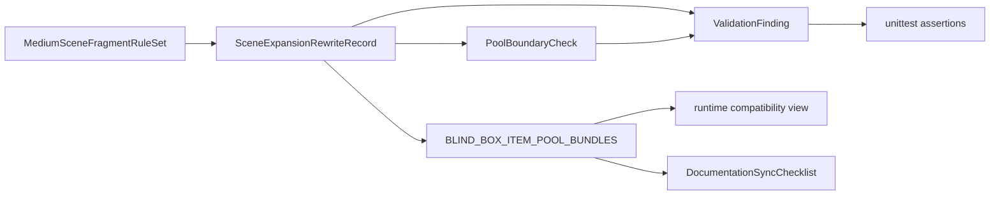

# Requirements: blind-box `scene_expansion_items` medium-scale scene fragments

本 PRD 将 `scene_expansion_items` 固定为“中号场景片段”模型，约束 20 个场景的全量重写、四池边界校验、超大/超小主体拦截、现有 `unittest` 兼容和文档同步检查。Phase 3 只定义可测试需求，不修改源码或运行时结构。

## Requirement Summary

| Priority | Count | Coverage |
|----------|-------|----------|
| Must Have | 6 | 语义模型、20 场景重写、质量校验、池边界、兼容回归、文档同步 |
| Should Have | 1 | 维护者可读的校验反馈与审查体验 |
| Could Have | 0 | 本阶段不扩展 |
| Won't Have | 0 | 以 [Product Brief](../product-brief.md) 的 Out of Scope 为准 |

## Functional Requirements

| ID | Title | Priority | Traces To |
|----|-------|----------|-----------|
| [REQ-001](REQ-001-formal-medium-scene-fragment-model.md) | 正式定义 medium-scale scene fragment 模型 | Must | [G-001](../product-brief.md#goals--success-metrics) |
| [REQ-002](REQ-002-all-scene-rewrite-and-uniqueness.md) | 全量重写 20 个 `scene_expansion_items` 并保持每场景 50 条唯一项 | Must | [G-002](../product-brief.md#goals--success-metrics) |
| [REQ-003](REQ-003-scale-quality-validation.md) | 建立超大主体与超小主体质量校验 | Must | [G-003](../product-brief.md#goals--success-metrics) |
| [REQ-004](REQ-004-pool-boundary-validation.md) | 校验 `scene_expansion_items` 与其余三池的边界 | Must | [G-001](../product-brief.md#goals--success-metrics), [G-003](../product-brief.md#goals--success-metrics) |
| [REQ-005](REQ-005-runtime-and-unittest-compatibility.md) | 保持运行时兼容视图和现有 `unittest` 契约 | Must | [G-004](../product-brief.md#goals--success-metrics) |
| [REQ-006](REQ-006-documentation-sync-checks.md) | 对稳定文档执行同步检查 | Must | [G-005](../product-brief.md#goals--success-metrics) |
| [REQ-007](REQ-007-maintainer-feedback-and-review.md) | 向维护者提供可定位的校验反馈和审查流程 | Should | [G-005](../product-brief.md#goals--success-metrics) |

## Non-Functional Requirements

| ID | Category | Title | Target |
|----|----------|-------|--------|
| [NFR-R-001](NFR-R-001-regression-compatibility.md) | Reliability | 回归兼容性 | 现有 `unittest` 与兼容映射校验 100% 通过 |
| [NFR-M-001](NFR-M-001-rule-maintainability.md) | Maintainability | 规则可维护性 | 规则集合可在 10 分钟内被维护者扫描并复用 |
| [NFR-U-001](NFR-U-001-first-eye-visible-wording.md) | Usability | 首眼可见命名一致性 | 20 个场景的新增条目保持清晰、可圈选、非微小主体 |

## Data Requirements

### Data Entities

| Entity | Description | Key Attributes |
|--------|-------------|----------------|
| `MediumSceneFragmentRuleSet` | 第四池的正式语义规则集合 | `allowed_families:list[str]`, `forbidden_large_roots:list[str]`, `forbidden_tiny_roots:list[str]`, `upgraded_information_exceptions:list[str]`, `notes:str` |
| `SceneExpansionRewriteRecord` | 单个场景的重写结果与结构约束 | `scene_id:int`, `scene_name:str`, `scene_expansion_items:list[str]`, `unique_count:int`, `matches_rule_set:bool` |
| `PoolBoundaryCheck` | 第四池与 `core_items` / `support_items` / `visible_small_items` 的边界检查结果 | `scene_name:str`, `item_name:str`, `conflicting_pool:str`, `conflict_type:str`, `resolution_hint:str` |
| `ValidationFinding` | 质量校验输出的失败项 | `scene_name:str`, `pool_name:str`, `item_name:str`, `rule_id:str`, `severity:str`, `message:str`, `recovery_hint:str` |
| `DocumentationSyncChecklist` | 稳定文档的同步检查记录 | `file_path:str`, `trigger_condition:str`, `required_update:bool`, `status:str`, `notes:str` |

### Data Flows

1. 先定义 `MediumSceneFragmentRuleSet`，再据此生成 20 个 `SceneExpansionRewriteRecord`。
2. 每个重写结果都必须经过 `PoolBoundaryCheck` 和 `ValidationFinding`。
3. 通过校验后，数据才能进入 `BLIND_BOX_ITEM_POOL_BUNDLES`，并继续暴露给运行时兼容视图。
4. 文档同步检查以已接受的语义模型为输入，只更新稳定规则，不复制长列表。

## Integration Requirements

| System | Direction | Protocol | Data Format | Notes |
|--------|-----------|----------|-------------|-------|
| `Game content extraction/data/blind_boxes.py` | Both | Python import | Python dict/list | 四池事实源，最终实现必须映射回该文件 |
| `Game content extraction/test_blind_box_content_model.py` | Outbound | unittest | Python assertions | 负责数量、唯一性、兼容性和质量规则回归 |
| `Game content extraction/agents.md` | Outbound | Markdown sync | UTF-8 Markdown | 记录稳定的 scene expansion 维护规则 |
| `agents.md` | Outbound | Markdown sync | UTF-8 Markdown | 仅在仓库级稳定规则需要补充时更新 |
| `README.md` | Outbound | Markdown sync | UTF-8 Markdown | 仅在用户可见行为变化时更新 |
| `.gitignore` | Outbound | Git metadata | text | 仅在本次变更引入新的缓存/构建产物时更新 |

## Constraints & Assumptions

### Constraints

- MUST 保持 20 个场景入口、四池 key 和每池 50 条唯一项不变。
- MUST NOT 引入第五池、UI 变更、运行时列结构变更、历史 key 变更或 draw history 语义变更。
- MUST 同时拦截“过大主体”与“过小主体”，不能只修一端。
- MUST 使用 RFC 2119 语义描述行为约束。
- SHOULD 让例外规则只保留“升级后的信息载体”，避免重新退化为卡片或标签池。

### Assumptions

- 用户已接受“中号场景片段”作为本轮唯一语义方向。
- 运行时兼容层无需新增字段即可承接新的第四池内容。
- 维护者更关心规则可扫描和失败可定位，而不是自动生成式重写工具。

## Priority Rationale

Must 范围覆盖“如果不先定义，后续实现就无法安全落地”的部分：正式模型、20 场景重写、质量闸门、四池边界、兼容回归和文档同步。维护者反馈体验列为 Should，因为它依赖前述规则存在，但仍是 library 规格要求中的重要开发体验补充。

## Traceability Matrix

| Goal | Requirements |
|------|--------------|
| G-001 | [REQ-001](REQ-001-formal-medium-scene-fragment-model.md), [REQ-004](REQ-004-pool-boundary-validation.md), [NFR-M-001](NFR-M-001-rule-maintainability.md) |
| G-002 | [REQ-002](REQ-002-all-scene-rewrite-and-uniqueness.md), [NFR-U-001](NFR-U-001-first-eye-visible-wording.md) |
| G-003 | [REQ-003](REQ-003-scale-quality-validation.md), [REQ-004](REQ-004-pool-boundary-validation.md), [REQ-007](REQ-007-maintainer-feedback-and-review.md) |
| G-004 | [REQ-005](REQ-005-runtime-and-unittest-compatibility.md), [NFR-R-001](NFR-R-001-regression-compatibility.md) |
| G-005 | [REQ-006](REQ-006-documentation-sync-checks.md), [REQ-007](REQ-007-maintainer-feedback-and-review.md), [NFR-M-001](NFR-M-001-rule-maintainability.md) |

## Open Questions

- [ ] 质量校验更适合采用“黑名单词根 + 少量白名单例外”还是“规则分类 + 逐场景例外表”？
- [ ] 是否需要在实现阶段为 20 个场景保留非规范性的词根参考表，帮助后续维护扩写？
- [ ] “升级后的信息载体”是否需要统一后缀约束，例如优先使用“板 / 面 / 页组 / 排列组”？

## References

- Derived from: [Product Brief](../product-brief.md)
- Derived from: [Glossary](../glossary.json)
- Derived from: [Refined Requirements](../refined-requirements.json)
- Next: [Architecture](../architecture/_index.md)
